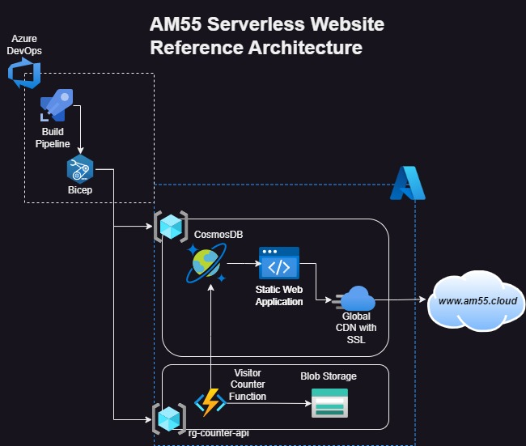

# Personal Website Azure Serverless
 
    
## About the Project

    
This repo have all resources and code created to feature my own resume and landing page about myself, using Azure Services.

Inspired by the Cloud Challenge book.

Conceived since the begining as the lowest cost first and as fun sandbox to test my knowledge about Azure Services and resources.

### Services and Technologies used

* ``CSS`` ``HTML`` ``JavaScript`` ``C#`` ``.NET``
* ``Bicep`` ``PowerShell`` ``Shell``
* ``Azure Blob Storage``
* ``Azure Functions``
* ``CosmosDB``
* ``Azure CDN``
* ``Azure Pipelines & Boards``

### Developing Notes

- Never coded in web languages before, at first i learned a bit of HTML and CSS and made a simple structure from scratch, it was good enough to test basic function and Azure services, but decided to changed to a more modern look used a free template disponibilized by StyleShout.

- In the first interaction to deploy the resources i used shell commands into Azure CLI, after learning more about Azure DevOps, Bicep language and Terraform, changed all IAC to Bicep or Powershell. 

- While developing the API found an amazing resource by madebygps, helped a lot.

- Integrated with my custom domain, to be more personal and professional.

- In the first interaction it was changes where deployed by simple Github Actions workflows. Migrated all to Azure DevOps, created build pipelines (changes on the site content, changes for attached files) and a release pipelines, consisting with a staging and prod enviroments.

<!-- ROADMAP -->
## Roadmap
- [ ] Add a Project section
- [  ] Add a F1 calendar and cool trivia section
- [  ] Add Nasa Picture of the Day Section
    
## Acknowledgments
- [Cloud Resume Challenge Book by Forrest Brazeal](https://cloudresumechallenge.dev/book/)
- [StyleShout Templates](https://styleshout.com/)
- [MadebyGPS API Repo](https://github.com/madebygps/serverless-resume-api)
- [Azure Infrastructure as Code Book By Henry Been](https://www.manning.com/books/azure-infrastructure-as-code)
- [Azure DevOps Services Documentation by Microsoft](https://learn.microsoft.com/en-us/azure/devops/user-guide/what-is-azure-devops?view=azure-devops)